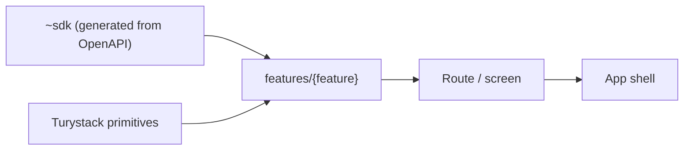

# Frontend Engineering Standards

> **Purpose.** This skill defines **how the Turystack frontend writes** what the
> constitution decides. `tury-stack-architecture-pattern` is a prerequisite: the
> law lives there, the mechanism lives here — a constitutional law is never
> rewritten in this skill, only cited by id.
>
> Decisions, ownership and invariants of the application code. `@turystack/react-web`, `@turystack/react-mobile`,
> `@turystack/react-hooks`, `frontend-primitives-pattern` and the stack tooling
> are the source of truth for components, props, setup and public API.

## Context

| | Web | Mobile |
|---|---|---|
| Routes | `src/routes/` · TanStack Router | `src/app/` · Expo Router |
| UI kit | `@turystack/react-web` | `@turystack/react-mobile` |
| API | Kubb SDK in `src/~sdk/` | Same generated contract |
| Server state | TanStack Query via SDK hooks | TanStack Query via SDK hooks |
| App shell | pathless/root route | `_layout.tsx` |

## Governed by the constitution

These laws live in `tury-stack-architecture-pattern` and are not restated here.
What follows in this section is how the Turystack frontend expresses them.

| ID | Law |
|---|---|
| `ARC-1` | A lower layer never imports an upper layer. |
| `ARC-CTR-1` | The contract is the single source; types derive from it. |
| `ARC-SEC-2` | The backend is the authorization authority; hiding is experience. |
| `ARC-10` | Secrets and PII stay out of bundle, log and telemetry. |
| `ARC-16` | The config package is the source of lint, format and TypeScript. |
| `ARC-17` | State that survives a reload, link or history lives in the address. |
| `ARC-18` | A read replica is derived; the write declares what it invalidates. |
| `ARC-19` | Untrusted data is neutralized at the output point. |
| `ARC-20` | A remote read has five outcomes; all of them decided. |

Domain, contract, state and UX decisions are shared. Only the navigation runtime
and the concrete primitives change.

`ARC-17` through `ARC-20` account for most of what looked like a "frontend
rule": where state lives, who invalidates the cache, what happens to user
content and how many outcomes a read has. None of them is about UI — they all
hold for a read model, a third-party API consumer or a native app.

## Mental model

- Every app integrates with an API; the generated SDK is its only door.
- A business component lives in `features/{feature}/components/`; the feature
  exposes only its `index.ts`.
- The route/screen owns params, search and navigation.
- A business component receives data and callbacks; it does not know the router.
- Server state belongs to the cache and stays derived (`ARC-CTR-7`); form state
  to the form; navigable state to the address (`ARC-17`).
- A generic primitive belongs to the library. A product-specific primitive is
  born locally only when there is real usage.

## Global invariants

| ID | Law |
|---|---|
| FE-2 | No HTTP happens outside the client used by the generated SDK. |
| FE-3 | Never edit `~sdk/`, `routeTree.gen.ts` or any other generated artifact. |
| FE-6 | Router state belongs to the route; the component receives props and callbacks. |
| FE-7 | A missing prop/primitive is solved in the library or in a justified app-local primitive; not with parallel HTML or an escape-hatch `className`. |

## Loading and real-time

- First load with no previous content → skeleton.
- Update that preserves visible context → loading overlay over the content.
- Full replacement of a list/page → a skeleton may replace the content.
- Filtered/paginated table preserves header/structure → overlay on the data
  region.
- A real-time update changes the cache silently; it shows no loading.

## Non-automated conventions

- Full names, kebab-case for files/folders and named exports.
- Early return; handlers named `handle*`; `unknown` with narrowing.
- No comment that merely narrates the code.
- Independent operations in parallel; dynamic batch with limited concurrency.

## How to navigate

Read `01-project-structure.md` and only the sections the task touches. Check the
library documentation for components, props, hooks and setup.
