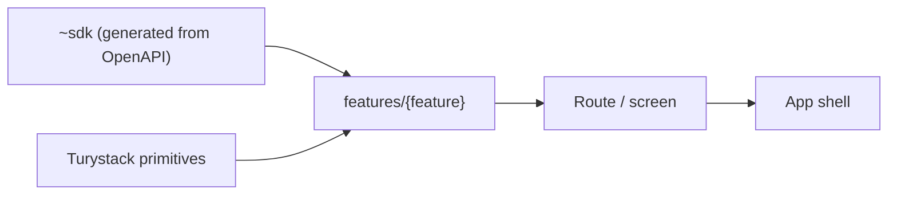

# Frontend Engineering Standards

> **Purpose.** This skill defines **how the Turystack frontend writes** what the
> constitution decides. `turystack-architecture-pattern` is a prerequisite: the
> law lives there, the mechanism lives here — a constitutional law is never
> rewritten in this skill, only cited by id.
>
> Decisions, ownership and invariants of the application code. `@turystack/react-web`, `@turystack/react-mobile`,
> `@turystack/react-hooks`, `frontend-primitives-pattern` and the stack tooling
> are the source of truth for components, props, setup and public API.

**Rules defined here:** none — every rule this file states is defined
elsewhere and cited by id.

## Context

| | Web | Mobile |
|---|---|---|
| Routes | `src/routes/` · TanStack Router | `src/app/` · Expo Router |
| UI kit | `@turystack/react-web` | `@turystack/react-mobile` |
| API | Kubb SDK in `src/~sdk/` | Same generated contract |
| Server state | TanStack Query via SDK hooks | TanStack Query via SDK hooks |
| App shell | pathless/root route | `_layout.tsx` |

## Governed by the constitution

These laws live in `turystack-architecture-pattern` and are not restated here.
What follows in this section is how the Turystack frontend expresses them.

| ID | Law | Where the frontend expresses it |
|---|---|---|
| `ARC-LAY-1` | A lower layer never imports an upper layer. | `01-project-structure.md` |
| `ARC-CTR-1` | The contract is the single source; types derive from it. | `02-sdk.md` |
| `ARC-CTR-7` | Contract data stays derived; never copied into state of its own. | `02-sdk.md` |
| `ARC-CON-9` | A read replica is derived; the write declares what it invalidates. | `02-sdk.md` |
| `ARC-DEL-8` | State that survives a reload, link or history lives in the address. | `04-routes-app-shell.md` |
| `ARC-DEL-9` | The identity of a resource opened over a surface lives in the address. | `04-routes-app-shell.md` |
| `ARC-ERR-8` | A remote read has five outcomes; all of them decided. | `07-ui-states-and-feedback.md` |
| `ARC-ERR-9` | An unavailable capability is shown inert with its reason, never erased. | `07-ui-states-and-feedback.md` |
| `ARC-CON-11` | A cascading write shows its blast radius before the confirmation. | `07-ui-states-and-feedback.md` |
| `ARC-SEC-2` | The backend is the authorization authority; what the client does is experience. | `12-security-permissions.md` |
| `ARC-SEC-7` | Secrets and PII stay out of bundle, log and telemetry. | `12-security-permissions.md` |
| `ARC-SEC-10` | Untrusted data is neutralized at the output point. | `12-security-permissions.md` |

Domain, contract, state and UX decisions are shared. Only the navigation runtime
and the concrete primitives change.

`ARC-DEL-8` through `ARC-CON-11` account for most of what looked like a "frontend
rule": where state lives, who invalidates the cache, what happens to user
content, how many outcomes a read has, what an open record does to the URL, what
a denied capability looks like and what a destructive write owes the user before
it runs. None of them is about UI — they all hold for a read model, a
third-party API consumer or a native app.

## Mental model

- Every app integrates with an API; the generated SDK is its only door.
- A business component lives in `features/{feature}/components/`; the feature
  exposes only its `index.ts`.
- The route/screen owns params, search and navigation.
- A business component receives data and callbacks; it does not know the router.
- Server state belongs to the cache and stays derived (`ARC-CTR-7`); form state
  to the form; navigable state to the address (`ARC-DEL-8`).
- A generic primitive belongs to the library. A product-specific primitive is
  born locally only when there is real usage.

## The four that get broken most

Pointers, not restatements — the law lives in the section that owns it, and that
is the text a review binds to:

| What goes wrong | Law | File |
|---|---|---|
| A `fetch`/`axios` call outside the SDK client | `API-1` | `02-sdk.md` |
| An edit to `~sdk/` or `routeTree.gen.ts` | `ARC-CTR-4`, `RTE-2` | `02-sdk.md`, `04-routes-app-shell.md` |
| A component reading the router instead of receiving props | `COM-3`, `RTE-1` | `03-components-client-state.md` |
| Parallel HTML or a `className` escape hatch instead of extending the primitive | `COM-5` | `03-components-client-state.md` |

The old `FE-n` numbering was folded into those sections; nothing was dropped.

## Non-automated conventions

- Full names, kebab-case for files/folders and named exports.
- Early return; handlers named `handle*`; `unknown` with narrowing.
- No comment that merely narrates the code.
- Independent operations in parallel; dynamic batch with limited concurrency.

## How to navigate

Read `01-project-structure.md` and only the sections the task touches. Check the
library documentation for components, props, hooks and setup —
`01-project-structure.md` › *Which library owns which concern* maps each concern
to its owner, and checking it before hand-writing a hook or a primitive is what
keeps `ARC-LAY-8` from being broken by accident.
