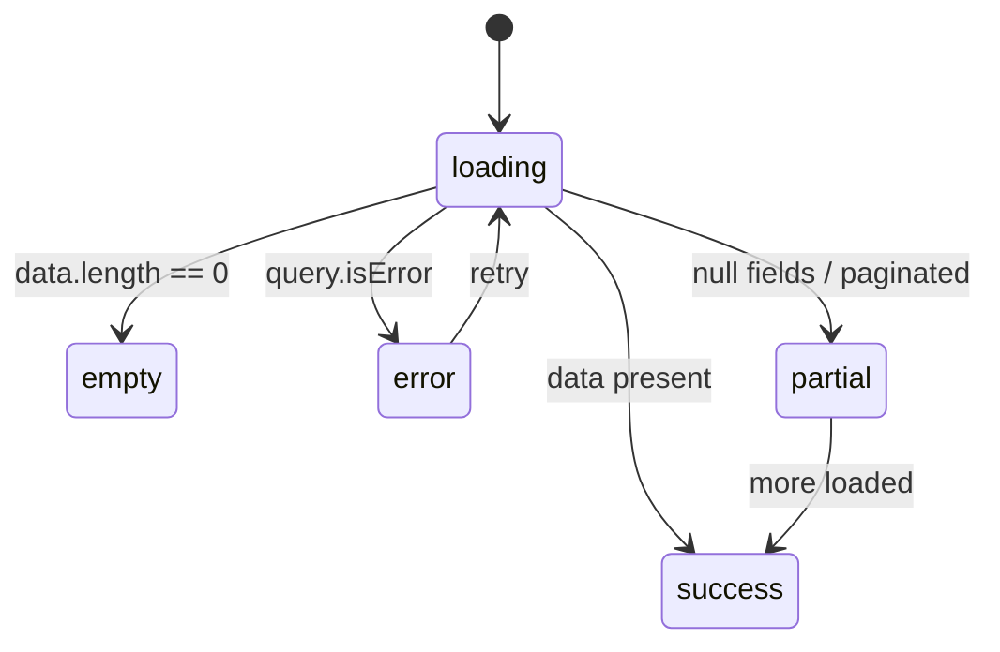

# UI States & Feedback

**Concept.** The backend answers "the operation succeeded or it threw". The frontend answers a harder question: **what the user SEES while it happens, and what they FEEL when it fails.** Every surface backed by an async query/mutation has several realities, not one. A component that only renders the happy path is "correct" for every structural gate — and still hands a white box to the real user with no data, a slow network or an expired token. This section turns "usable" into a gate, not into hope.

> **How to read this file.** 🌐 Generic pattern is the portable law; 🛠️
> Project-specific is that same law expressed as code in TypeScript · React ·
> TanStack · @turystack. The split, `XXX-n` versus `XXX-Ln`, and why an
> `ARC-…` law is cited and never restated: `turystack-frontend-pattern` › *How
> a section is written*.

## In this file

- [🌐 Generic pattern (portable — stack-independent)](#generic-pattern-portable-stack-independent)
  - [Invariants (the law the gates enforce)](#invariants-the-law-the-gates-enforce)
- [Governed by the constitution](#governed-by-the-constitution)
- [🛠️ Project-specific (TypeScript · React · TanStack · @turystack)](#project-specific-typescript-react-tanstack-turystack)
  - [✅ How to do it](#how-to-do-it)
  - [❌ Never do](#never-do)

**Rules defined here:** `UST-2` · `UST-3` · `UST-4` · `UST-5` · `UST-6` · `UST-7` · `UST-8` · `UST-9` · `UST-10` · `UST-11` — the law itself is the *Invariants* table below; every ❌ item cites the id it violates.

**Retired ids:** `UST-1` — retired, not renumbered. A review or commit citing
one points at a rule that no longer exists; the number is never reused.

---

## 🌐 Generic pattern (portable — stack-independent)

**ARC-ERR-8 — the five realities of every surface with data.** Every surface backed by async data has **five states** — and each one is decided explicitly before any styling of the happy path. `success` is the only one that is always born; the other four are the law. The fixtures that prove the five branches live in the tests (see 13-testing.md). **[ARC-ERR-8]**

| State | Law |
|---|---|
| **loading** | Skeleton on the first load or on a full replacement; `LoadingOverlay` when valid content stays on screen during an update; a spinner only for a compact operation of unknown shape. Real-time updates in-place, with no loading. |
| **empty** | An intentional state of its own, with copy + the next action. Never visually identical to loading. |
| **error** | A retry affordance, not a dead end. It tells "failed to load" apart from "you are not allowed to see this" (permission). |
| **denied** | Not one of the five, decided alongside them: the reason in the empty state's shape, no retry — the law is `ARC-ERR-9`/`UST-9`. |
| **partial** | Paginated / streamed / null fields — the dangerous middle that devs forget. |
| **success** | The only one that normally gets built. |



**UST-2 — honest loading preserves continuity.** Use a skeleton that replicates the next shape on the first load or when the whole useful region will be replaced; use a loading overlay over valid content during an async update that enters loading; use a spinner only for a compact, indeterminate operation of unknown shape. Real-time events update the content in-place without entering loading. Never cause a flash/layout shift nor disguise loading as another state (see 02-sdk.md). **[UST-2]**

**UST-3 — empty is product, not absence.** The empty state is an intentional state: copy that explains + the next possible action. Never visually identical to loading — the user has to tell "I am waiting" apart from "there is nothing here". **[UST-3]**

**UST-4 — error with a way out.** The error state offers retry, never a dead end. It tells "failed to load" (retry solves it) apart from "you are not allowed to see this" — the second one is not an error state at all, it is the denied surface of `UST-9`. The message shown is the one that came from the API, as it came (see 11-error-handling.md). **[UST-4]**

**UST-5 — partial is a state, not a bug.** A paginated list shows the current page + honest navigation; an optional/null field renders a deliberate placeholder (`—`), never a raw `undefined` nor a crash. The middle ground between "nothing" and "everything" is designed, not endured. Dynamic pagination consumption in 02-sdk.md. **[UST-5]**

**UST-6 — mutation feedback contract.** Every async action has: a pending that **disables the trigger** (no double-fire) and a result that is **always surfaced** — success and error via toast or inline. A silent mutation does not exist. **[UST-6]**

**UST-7 — destructive confirms first.** Every destructive action goes through explicit confirmation before firing. **[UST-7]**

**ARC-ERR-9 — a blocked action stays on screen, inert, with its reason.** An action the user cannot perform **right now** is never removed from the surface: it renders `disabled` and carries a tooltip stating why. Permission is only one of the causes, and the business ones are the majority — entity state (`the invoice is already paid`), commercial plan or contract (`the organization is on the minimum contract and cannot raise its credit limit`), unmet dependency (`no payment method registered`), exhausted limit (`10 of 10 seats in use`), lifecycle (`the cycle is closed`). The permission case is the same law wearing `Protected`: it blocks and explains, it does not erase (see 12-security-permissions.md). Removing the affordance produces the four failures the constitution lists — the user does not know the capability exists, does not know what unlocks it, sees a different screen than a colleague on the same build, and reads the absence as a bug. **Exception:** a control disabled while its own mutation is in flight owes no sentence — the loading indicator already is the reason (`UST-6`). **[ARC-ERR-9]**

**UST-8 — the reason is copy with a contract, and it is reachable.** The disabled reason is a short sentence naming what is missing (`Requires the Delete users permission`, `Only a draft invoice can be edited`, `Raising the credit limit requires a contract above the minimum tier`) — never a generic `Not available`, never the raw code, never data the user may not see. It comes from the permission/error catalogue (`ARC-SEC-12`, `ARC-ERR-1`), so the same block reads the same on every screen. When the product has a path that unlocks it, the surface offers that path next to the inert control (`Compare plans`, `Add a payment method`, `Request access`) — the blocked control is where the user already is, which makes it the cheapest place to explain a business rule. And it has to be **reachable**: a disabled control does not fire pointer events, so the tooltip hangs off a wrapper around it, never off the control itself — an unreachable tooltip is the same as no reason at all, plus the illusion of one. Keyboard and screen reader reach it too (see 08-accessibility.md). **[UST-8]**

**UST-9 — a denied read renders its reason in place of the content.** A list, table, panel or page the user may not read — no permission, but also a plan/contract that does not include it (`Usage reports start on the Business contract`), a closed period, a feature not contracted — renders a **stated-reason card in the empty state's shape**: icon, title, the reason, and the next action when one exists (`Request access`, `Compare contracts`). It is not the error branch: there is no retry, because retrying changes nothing. It is not the empty branch either: `there is nothing here` and `you may not see what is here` are different facts, and collapsing them makes the user believe the data was lost. The surface stays in the layout — the table keeps its header and toolbar, the section keeps its title — so the screen does not silently shrink between two accounts. **[UST-9]**

**UST-10 — the five outcomes are derived once, in the canonical order.** The order between them is law, not preference: `denied` is decided **before** `error`, because a denial that reaches the generic branch is swallowed by it and the user is offered a retry that can never work; `empty` is decided **after** the read succeeded, because a pending `undefined` is not an empty list. Restating that order per surface means restating it wrongly somewhere, and the wrong one stays invisible until a customer hits it. So the order lives in one derivation that every surface consumes, and a screen chooses **what** each outcome looks like, never **whether** it exists. **[UST-10]**

**UST-11 — a data surface receives the outcome, never a fallback.** A table, a list, a select or a region takes the derived outcome and paints all five states itself — that is what makes forgetting one impossible rather than merely discouraged. Feeding it `query.data ?? []` instead is the defect this whole section exists to stop: it converts a failure into `no results found`, which is the one screen that tells the user a lie they cannot detect. The data is unreachable before the read succeeded, so the fallback has nowhere to happen. **[UST-11]**

**ARC-CON-11 — a destructive action confirms with its blast radius.** When deleting/deactivating reaches other entities, the confirmation is a **modal** that shows what will be dragged along **before** the confirm button: the counts per impacted entity, a sample of the affected items when it helps the decision, and what is irreversible. The impacted set comes from the backend's impact read — the client never counts it from the loaded list, which sees 10 of 4,300 rows and never sees the effects it did not fetch. While that read is pending, the confirm button stays inert with its reason (`UST-8`); if it fails, confirming is not offered — a blind confirmation is worse than no confirmation. When the radius is zero or trivial (the entity has no dependents), the simple `Confirm` from `UST-7` is enough. **[ARC-CON-11]**

**ARC-CON-10 — optimistic declares the three steps.** An optimistic update only exists with the three written down: a snapshot before the write to the cache; reconciliation with the response on success (the server may have written a different value); restoring the snapshot **and a visible error** on failure. Reverting silently is worse than not being optimistic — the value "comes back on its own" and the user does not know the action failed. Without the three, invalidate and wait. **[ARC-CON-10]**

### Invariants (the law the gates enforce)


| ID | Law (one line) | Class | Gate | Detector (🛠️) |
|---|---|---|---|---|
| UST-2 | Skeleton on the first load/full replacement; overlay when valid content stays; real-time with no loading | constitutional | `manual` | Scenarios 1 and 4 / ❌ |
| UST-3 | Intentional empty with copy + next action; never identical to loading | constitutional | `manual` | Scenario 1 / ❌ |
| UST-4 | Error with retry; failed-to-load ≠ permission-denied; the API message shown as it came | constitutional | `manual` | Scenario 1 / ❌ |
| UST-5 | Partial designed: honest pagination, null field with a deliberate placeholder | constitutional | `manual` | Scenario 1 / ❌ |
| UST-6 | Mutation: pending disables the trigger; success/error always surfaced (toast or inline) | constitutional | `manual` | Scenario 2 / ❌ |
| UST-7 | A destructive action goes through explicit confirmation | constitutional | `manual` | Scenario 2 / ❌ |
| UST-8 | The disabled reason is catalogue copy, specific, PII-free, and reachable via a wrapper (the disabled control fires no pointer event) | constitutional | `test:denial-visible` | Scenario 5 / ❌ |
| UST-9 | A denied read renders a reason card in the empty state's shape, with no retry, keeping the surface in the layout | constitutional | `test:denial-visible` | Scenario 6 / ❌ |
| UST-10 | The five outcomes come from one derivation in the canonical order; a surface chooses what each looks like, never whether it exists | constitutional | `gate:data-outcome` | Scenario 1 / ❌ |
| UST-11 | A data surface receives the outcome; server data never reaches it through a fallback | constitutional | `grit:no-data-fallback` | Scenario 1 / ❌ |

## Governed by the constitution

These laws live in `turystack-architecture-pattern` and are not restated here.
What follows in this section is how the Turystack frontend expresses them.

| ID | Law | How this stack expresses it |
|---|---|---|
| `ARC-ERR-8` | A remote read has five outcomes; all of them decided. | five branches with intentional DOM, proven by fixtures in the component test |
| `ARC-ERR-9` | Unavailability is stated, never hidden: inert action with a reason, denied surface with a reason (`UST-8`, `UST-9`). | inert action with a reachable reason (`UST-8`); denied surface with `Unavailable` (`UST-9`) |
| `ARC-CON-10` | An optimistic write declares snapshot, reconciliation and rollback. | `setQueryData` only with snapshot, reconciliation and a visible failure |
| `ARC-CON-11` | A cascading write declares its blast radius, read from the authority, before the confirm. | the confirm reads the impacted set from the API before offering the button |
| `ARC-CON-9` | A replica is derived; a write declares what it invalidates. | the mutation invalidates the generated keys of what it changed |
| `ARC-ERR-6` | The consumer branches on a code, never on a message. | the branch reads `error.code`, never the rendered message |
| `ARC-ERR-7` | Every error becomes visible feedback or a propagated failure. | every failure becomes inline feedback, a toast or a boundary — never a swallow |

The `UST-*` laws that remain are presentational: *how* each outcome shows up in
this stack (skeleton × overlay, empty copy, retry affordance). The fact that the
five exist is `ARC-ERR-8`.

---

## 🛠️ Project-specific (TypeScript · React · TanStack · @turystack)

> Code that implements the rules above in this stack. **Swapping stacks rewrites only this part.** Each block inherits the id of the rule it demonstrates.
>
> **⚠️ Comments in the examples are didactic** — they explain the rule being demonstrated. **Never copy a comment into real code**: the standard is zero comments (see 00-overview.md).

**Mechanisms per rule:**

- **ARC-ERR-8 / UST-10** — `useDataOutcome` from `@turystack/react-hooks` turns a `~sdk` query result into `DataOutcome<T>`, a union discriminated on `status`: `pending`, `denied`, `error`, `empty`, `success`. The canonical order lives in that derivation, so no screen restates it. `select` cuts the rows out of the paginated envelope (`meta` still goes to `Pagination` by itself — `API-7`); `empty` defaults to an empty array and takes a predicate when the payload is not one. Which error codes mean *denied* is answered once, at the root, through `DataOutcomeContext` — never by a `statusCode === 403` scattered through components (`ARC-ERR-6`, `ERR-8`). `data` exists only on the `success` member, which is what makes the fallback of `UST-11` impossible to write. The fixtures for the five states are mounted in tests — see 13-testing.md.
- **UST-11** — react-web's `Table`, `List` and `Select` take `outcome` in place of `items`/`options`, mutually exclusive in the type, and paint all five states: skeleton rows while pending, the reason while denied, a retry while failed, `emptySection` while empty, and a `LoadingOverlay` over valid rows while a refresh is in flight — which is `UST-2` decided by the primitive instead of by each screen. For a surface that is none of the three — a panel, a card, a section of a sheet — `Loaded` takes the same value and hands the data to a function child. Where nothing paints it for you, such as a confirmation reading its blast radius, the union is read directly and the compiler asks for the branch you left out.
- **UST-2** — react-web's `Skeleton` replicates the next shape on the initial `isPending` or on a full replacement, such as list pagination. When the query keeps the previous data during `isFetching`, `LoadingOverlay` preserves that content; in `Table`, use the `loading` prop for filter, sort and pagination after the first result. `Loader` stays restricted to a compact operation of unknown shape. A subscription/real-time event applies the change to the cache without turning loading on.
- **UST-3** — an empty composed with `Flex` + `Typography` + a next-action `Button`; in `Table`, the `emptySection` prop.
- **UST-4** — `Alert variant="destructive"` with `Alert.Title`/`Alert.Description` + `Alert.Action` calling `refetch`. The description is `error.message` **as it came** (branch only on `error.code` — see 11-error-handling.md). A permission denial does not render the generic retry alert: it renders the `Unavailable` card (`UST-9`) — branch on `error.code` (see 11-error-handling.md), never on the HTTP status scattered through the component.
- **UST-5** — react-web's `Pagination` fed by the response's `meta` (`mode: 'page' | 'cursor'` — the complete switch is a law of 02-sdk.md); an optional field renders a deliberate `—`.
- **UST-6** — `Button loading={isPending}` (the prop already blocks a new click); react-web's `toast.success(...)` / `toast.error(error.message)`; an inline field error via RHF's `setError` (see 05-forms.md). Invalidating the list on success is a law of 02-sdk.md.
- **UST-7** — react-web's `Confirm` (`title`, `description`, `onConfirm`, `onCancel`) controlled by `useDisclosure` from `@turystack/react-hooks` — never a hand-rebuilt modal (see 03-components-client-state.md).
- **ARC-ERR-9 / UST-8** — who decides the block: a **fact in the response** (`invoice.status`, `data.length`) is read straight from the SDK type; a **business rule** (contract tier, quota, lifecycle) arrives as a published verdict — a flag plus its reason in the entity's contract (`organization.creditLimitPolicy.blockedReason`), and the component never re-derives the rule from tier/plan fields. Missing verdict in the contract is a backend blocker like any missing symbol (see 02-sdk.md), not a rule to reimplement here. `Tooltip content="…"` from react-web **wrapping** the disabled control. The library's `Button` carries `disabled:pointer-events-none` (styles law in the frontend-primitives-pattern skill), so a `Tooltip` bound straight to the disabled button never fires: the trigger is a wrapper element around it (`<Tooltip content="…"><span tabIndex={0}><Button disabled /></span></Tooltip>`). If `Tooltip` does not yet expose a first-class way to describe a disabled control, that is a gap to close in the lib — never ship the reason as a `title` attribute or drop it. Permission blocks go through `<Protected>`, which applies exactly this treatment (see 12-security-permissions.md).
- **UST-9** — `Unavailable` is an app-local primitive in `src/ui/unavailable/` (same folder rank as `Page` and `Protected`): icon + `Typography` title + reason + an optional action. The name is deliberately not `PermissionDenied`: the same card serves a plan/contract that does not include the feature, a closed period or a permission the session lacks. In a `Table`, it goes in the `emptySection` prop so header and toolbar survive; in a list/panel, it replaces the body. It is chosen by `error.code` from the catalogue, by a capability flag the entity's contract publishes, or by `<Protected fallback={<Unavailable … />}>` when permission is known upfront and no request is even made.
- **ARC-CON-11** — the impact read from the `~sdk` (`useGetUserDeleteImpact({ userId })`, name following the backend's contract), consumed **inside** the confirmation modal so it fires when the modal opens, not on every row render. react-web's `Modal` composes header + impact body + footer — `Confirm` stays for the radius-free case (`UST-7`). While `isPending`, the confirm `Button` renders `disabled` with the reason `Checking what will be affected`; on `error`, the modal shows the failure and offers only `Cancel` and retry.
- **ARC-CON-10** — TanStack Query: `onMutate` cancels the query, takes a snapshot (`getQueryData`) and returns it as context; `onError` restores it (`setQueryData(queryKey, context.previous)`); `onSettled` invalidates — the final truth comes from the server.

### ✅ How to do it

**Scenario 1 — a query-backed list, with the five outcomes derived once:** `[ARC-ERR-8, UST-2, UST-3, UST-4, UST-5, UST-10, UST-11]`
```tsx
// src/features/invoices/components/invoice-list/invoice-list.types.ts
import type { ListInvoicesQuery } from '@/~sdk/invoices'

export type InvoiceListProps = {
  params: ListInvoicesQuery
  onCreate?: () => void
  onPageChange: (page: number) => void
  onLimitChange: (limit: number) => void
}
```
```tsx
// src/features/invoices/components/invoice-list/invoice-list.tsx
import { useDataOutcome } from '@turystack/react-hooks'
import { Button, EmptyState, List } from '@turystack/react-web'

import { useListInvoices } from '@/~sdk/invoices'

import { InvoiceCard } from '@/features/invoices/components/invoice-card'

import type { InvoiceListProps } from './invoice-list.types'

export function InvoiceList({
  onCreate,
  onLimitChange,
  onPageChange,
  params,
}: InvoiceListProps) {
  const query = useListInvoices(params)
  const outcome = useDataOutcome({
    query,
    select: (page) => page.data,
  })

  return (
    <List
      emptySection={
        // empty: intentional — copy + next action, and the only one of the five
        // that carries wording of this screen's own
        <EmptyState
          action={<Button onClick={onCreate}>New invoice</Button>}
          description="Create the first invoice to get started"
          title="No invoices around here"
        />
      }
      itemKey="invoiceId"
      outcome={outcome}
      pagination={
        // partial: the mode the contract returned, never one of our own (API-7)
        query.data?.meta.mode === 'page'
          ? {
              mode: 'offset',
              onPageChange,
              onRowsPerPageChange: onLimitChange,
              page: query.data.meta.page,
              rowsPerPage: query.data.meta.limit,
              total: query.data.meta.totalItems,
            }
          : undefined
      }
      renderItem={(invoice) => <InvoiceCard invoice={invoice} />}
    />
  )
}
```

Loading, error and denied are not absent from this component — they are decided
by the primitive, from the same value, in the order `UST-10` fixes. What stayed
is the only decision that was ever this screen's: what its empty state says.

For a surface that is neither a table nor a list — a panel, a card, a section of
a sheet — `Loaded` takes the same value: `[UST-10, UST-11]`

```tsx
// src/features/organizations/components/organization-contract-panel/…tsx
const outcome = useDataOutcome({
  query: useGetContract({ organizationId }),
})

return (
  <Loaded outcome={outcome} size="sm">
    {(contract) => <ContractSummary contract={contract} />}
  </Loaded>
)
```

And where nothing paints it for you — a confirmation that has to read its blast
radius before offering the button (`ARC-CON-11`) — the union is read directly,
and the compiler asks for the branch you left out: `[UST-10]`

```tsx
switch (outcome.status) {
  case 'pending':
    // the confirm stays inert with its reason while the impact is read (UST-8)
    return <ImpactSkeleton reason="Checking what will be affected" />
  case 'denied':
    return <Unavailable reason={outcome.reason} />
  case 'error':
    // a blind confirmation is worse than no confirmation: only Cancel and retry
    return <ImpactFailed onRetry={outcome.retry} />
  case 'empty':
    return <Confirm description="This user drags nothing along." onConfirm={handleConfirm} />
  case 'success':
    return <ImpactConfirm impact={outcome.data} onConfirm={handleConfirm} />
}
```

**Scenario 2 — mutation with pending, feedback and a destructive `Confirm` (an invoice drags nothing along: radius-free case):** `[UST-6, UST-7]`
```tsx
// src/features/invoices/components/invoice-delete/invoice-delete.tsx
import { useDisclosure } from '@turystack/react-hooks'
import { Button, Confirm, toast } from '@turystack/react-web'

import { useDeleteInvoice } from '@/~sdk/invoices'

import type { InvoiceDeleteProps } from './invoice-delete.types'

export function InvoiceDelete({ invoice, onSuccess }: InvoiceDeleteProps) {
  const confirm = useDisclosure()
  const { isPending, mutate } = useDeleteInvoice()

  function handleConfirm() {
    mutate(
      { invoiceId: invoice.invoiceId },
      {
        onSuccess: () => {
          toast.success('Invoice deleted') // success ALWAYS surfaced
          confirm.close()
          onSuccess?.() // list invalidation: see 02-sdk.md
        },
        onError: (error) => {
          toast.error(error.message) // message as it came from the API — see 11-error-handling.md
        },
      },
    )
  }

  return (
    <>
      {/* pending disables the trigger — loading blocks the double-fire */}
      <Button loading={isPending} onClick={confirm.open} variant="destructive">
        Delete invoice
      </Button>
      <Confirm
        description="The invoice will be permanently deleted."
        onCancel={confirm.close}
        onConfirm={handleConfirm}
        open={confirm.opened}
        title="Delete invoice?"
      />
    </>
  )
}
```

**Scenario 3 — optimistic update with a defined rollback:** `[ARC-CON-10]`
```tsx
// src/features/notifications/components/notification-item/notification-item.tsx — mutation excerpt
import { useQueryClient } from '@tanstack/react-query'
import { toast } from '@turystack/react-web'

import {
  listNotificationsQueryKey,
  useReadNotification,
} from '@/~sdk/notifications'

import type { NotificationItemProps } from './notification-item.types'

export function NotificationItem({ notification, params }: NotificationItemProps) {
  const queryClient = useQueryClient()
  const queryKey = listNotificationsQueryKey(params)

  const { mutate } = useReadNotification({
    mutation: {
      onMutate: async ({ notificationId }) => {
        await queryClient.cancelQueries({ queryKey })
        const previous = queryClient.getQueryData(queryKey) // snapshot = the rollback
        queryClient.setQueryData(queryKey, (current) =>
          current
            ? {
                ...current,
                data: current.data.map((item) =>
                  item.notificationId === notificationId
                    ? { ...item, readAt: new Date().toISOString() }
                    : item,
                ),
              }
            : current,
        )
        return { previous }
      },
      onError: (error, _variables, context) => {
        queryClient.setQueryData(queryKey, context?.previous) // DEFINED rollback
        toast.error(error.message)
      },
      onSettled: () => {
        queryClient.invalidateQueries({ queryKey }) // the final truth comes from the server
      },
    },
  })

  // ...
}
```

**Scenario 4 — choosing feedback by continuity:** `[UST-2]`

| Case | Implementation |
|---|---|
| First load of a list, table or chart | `Skeleton` in the final shape |
| List pagination that swaps every card/item | `Skeleton` of the next items |
| Table filter, sort or pagination with the previous data preserved | `<Table loading />` |
| Filter on an already rendered chart | `LoadingOverlay` over the previous chart |
| Subscription/real-time event | update the cache and render in-place, with no loading state |

**Scenario 5 — a blocked action, by a local fact and by a business rule:** `[ARC-ERR-9, UST-8]`
```tsx
// src/features/invoices/components/invoice-edit-action/invoice-edit-action.tsx
import { Button, Tooltip } from '@turystack/react-web'

import type { InvoiceEditActionProps } from './invoice-edit-action.types'

export function InvoiceEditAction({ invoice, onEdit }: InvoiceEditActionProps) {
  // ONE source: while a reason exists the control is inert, and the reason is on screen.
  // Deriving `disabled` from the reason makes "disabled with no explanation" unrepresentable.
  const blockedReason =
    invoice.status === 'draft' ? undefined : 'Only a draft invoice can be edited'

  function handleEdit() {
    onEdit?.(invoice)
  }

  return (
    // the wrapper is the tooltip trigger: a disabled Button fires no pointer event
    <Tooltip content={blockedReason}>
      <span tabIndex={0}>
        <Button disabled={Boolean(blockedReason)} onClick={handleEdit}>
          Edit invoice
        </Button>
      </span>
    </Tooltip>
  )
}
```

The block above is a **fact the component already has** (`invoice.status`), so it
is decided locally. A block that is a **business rule** is not: the backend
publishes the verdict and its reason, and the component renders what it received
— re-deriving the rule here means the screen keeps blocking by last quarter's
contract tiers, silently.

```tsx
// src/features/organizations/components/credit-limit-action/credit-limit-action.tsx
import { Button, Flex, Tooltip } from '@turystack/react-web'

import type { CreditLimitActionProps } from './credit-limit-action.types'

export function CreditLimitAction({
  onComparePlans,
  onUpdateLimit,
  organization,
}: CreditLimitActionProps) {
  // the contract publishes the verdict + the catalogue reason — the tier rule
  // ("minimum contract cannot raise the limit") lives in the domain, not here
  const { blockedReason } = organization.creditLimitPolicy

  function handleUpdateLimit() {
    onUpdateLimit?.(organization)
  }

  function handleComparePlans() {
    onComparePlans?.()
  }

  return (
    <Flex align="center" gap="sm">
      <Tooltip content={blockedReason}>
        <span tabIndex={0}>
          <Button disabled={Boolean(blockedReason)} onClick={handleUpdateLimit}>
            Raise credit limit
          </Button>
        </span>
      </Tooltip>
      {/* the reason has an exit: the path that unlocks it sits right next to it */}
      {Boolean(blockedReason) && (
        <Button onClick={handleComparePlans} variant="link">
          Compare contracts
        </Button>
      )}
    </Flex>
  )
}
```

On screen: the organization on the minimum contract sees `Raise credit limit`
inert, reads *"Raising the credit limit requires a contract above the minimum
tier"*, and has `Compare contracts` one click away. The version that erases the
button teaches the customer the product does not do it.

**Scenario 6 — a denied read surface: reason in place of the content:** `[ARC-ERR-9, UST-9, UST-4]`
```tsx
// src/features/reports/components/report-list/report-list.tsx — branch excerpt
import { Alert, Button, Skeleton, Table } from '@turystack/react-web'

import { ErrorCode } from '@/~sdk/errors'
import { useListReports } from '@/~sdk/reports'

import { Unavailable } from '@/ui/unavailable'

export function ReportList({ params }: ReportListProps) {
  const { data, error, isPending, refetch } = useListReports(params)

  function handleRetry() {
    refetch()
  }

  if (isPending) {
    return <Skeleton className="h-64" />
  }

  // denied comes BEFORE the generic error branch — otherwise it renders a retry
  // button that will fail forever (the code comes from the catalogue: 11-error-handling.md)
  if (error?.code === ErrorCode.FORBIDDEN) {
    return (
      // empty's shape, denial's content — and no retry affordance
      <Unavailable
        description="Ask an administrator for the Read reports permission to see this list."
        title="You do not have access to these reports"
      />
    )
  }

  if (error) {
    return (
      <Alert variant="destructive">
        <Alert.Title>Could not load the reports</Alert.Title>
        <Alert.Description>{error.message}</Alert.Description>
        <Alert.Action>
          <Button onClick={handleRetry} variant="outline">Try again</Button>
        </Alert.Action>
      </Alert>
    )
  }

  // in a table the denial goes in emptySection: header and toolbar stay,
  // so the screen does not silently shrink for whoever lacks the permission
  return <Table columns={columns} itemKey="reportId" items={data.data} />
}
```

**Scenario 7 — destructive with a blast radius before the confirm:** `[ARC-CON-11, UST-6, UST-8]`
```tsx
// src/features/users/components/user-delete/user-delete.tsx
import { useDisclosure } from '@turystack/react-hooks'
import { Button, Modal, Tooltip, toast } from '@turystack/react-web'

import { useDeleteUser, useGetUserDeleteImpact } from '@/~sdk/users'

import { UserDeleteImpact } from '@/features/users/components/user-delete-impact'

import type { UserDeleteProps } from './user-delete.types'

export function UserDelete({ onSuccess, user }: UserDeleteProps) {
  const confirm = useDisclosure()
  // the impact is a READ OF THE BACKEND, fired when the modal opens — never counted here
  const impact = useGetUserDeleteImpact(
    { userId: user.userId },
    { query: { enabled: confirm.opened } },
  )
  const { isPending: deleting, mutate } = useDeleteUser()

  function getConfirmBlockedReason() {
    if (impact.isPending) {
      return 'Checking what will be affected'
    }

    if (impact.error) {
      return 'Could not check the impact of this deletion' // blind confirmation is not offered
    }

    return undefined
  }

  const blockedReason = getConfirmBlockedReason()

  function handleConfirm() {
    mutate(
      { userId: user.userId },
      {
        onSuccess: () => {
          toast.success('User deleted')
          confirm.close()
          onSuccess?.()
        },
        onError: (error) => {
          toast.error(error.message)
        },
      },
    )
  }

  function handleOpenChange(open: boolean) {
    if (!open) {
      confirm.close()
    }
  }

  return (
    <>
      <Button onClick={confirm.open} variant="destructive">Delete user</Button>
      {/* Modal, not Confirm: the radius has to be READ before the decision (UST-7 covers the radius-free case) */}
      <Modal onChange={handleOpenChange} open={confirm.opened}>
        <Modal.Content>
          <Modal.Header closable>
            <Modal.Header.Title>Delete {user.name}?</Modal.Header.Title>
          </Modal.Header>
          <Modal.Body>
            {/* the five states of the impact read live inside this component */}
            <UserDeleteImpact
              error={impact.error}
              impact={impact.data}
              loading={impact.isPending}
            />
          </Modal.Body>
          <Modal.Footer>
            <Button onClick={confirm.close} variant="outline">Cancel</Button>
            <Tooltip content={blockedReason}>
              <span tabIndex={0}>
                <Button
                  disabled={Boolean(blockedReason)}
                  loading={deleting}
                  onClick={handleConfirm}
                  variant="destructive"
                >
                  Delete user
                </Button>
              </span>
            </Tooltip>
          </Modal.Footer>
        </Modal.Content>
      </Modal>
    </>
  )
}
```

The impact's shape (`counts per entity`, sample, what is irreversible) comes from
the contract like everything else (see 02-sdk.md) — `UserDeleteImpact` renders
what it received and counts nothing on its own.

### ❌ Never do

```tsx
// ❌ [ARC-ERR-8] happy-path-only: zero branches — a white box for whoever has no data
export function InvoiceList({ params }: InvoiceListProps) {
  const { data } = useListInvoices(params)
  return <>{data?.data.map((invoice) => <InvoiceCard invoice={invoice} key={invoice.invoiceId} />)}</>
}

// ❌ [UST-2] a generic spinner with a known shape — flash + layout shift on the swap
if (isPending) {
  return <Loader />
}

// ❌ [UST-2] a skeleton wipes a useful table during pagination/refetch
if (isFetching) {
  return <UserTableSkeleton />
}

// ❌ [UST-2] a real-time event treated as a new blocking request
return <Table loading={lastEventIsBeingApplied} />

// ❌ [UST-11, UST-3] silent fallback: a failed or pending read turns into a FALSE empty,
// which is the one screen the user cannot tell apart from the truth
const invoices = data?.data ?? []
if (invoices.length === 0) {
  return <Typography>No invoices</Typography>
}

// ❌ [UST-10] the five branches restated by hand — this one puts `error` before
// `denied`, so every denial is offered a retry that can never work
if (isPending) return <Skeleton />
if (error) return <Alert variant="destructive">…</Alert>
if (error?.code === ErrorCode.FORBIDDEN) return <Unavailable /> // unreachable

// ❌ [UST-10] the order restated correctly, and still wrong: the next screen
// restates it again, and that is the one that gets it backwards
if (isPending) return <Skeleton />
if (isDenied) return <Unavailable />
if (error) return <Alert variant="destructive">…</Alert>

// ❌ [UST-11] the outcome derived and then thrown away to feed the old prop
const outcome = useDataOutcome({ query })
<Table items={outcome.status === 'success' ? outcome.data : []} … />

// ❌ [UST-4] a dead-end error with a hand-rewritten message (see 11-error-handling.md)
if (error) {
  return <Typography>Something went wrong</Typography>
}

// ❌ [UST-5] an optional field rendered raw — partial not designed
<Typography>{formatDate(invoice.paidAt)}</Typography> // paidAt null → "Invalid Date" on screen

// ❌ [UST-6, UST-7] destructive with no Confirm, no pending, no feedback —
// a guaranteed double-fire and the user never knows whether it worked
<Button onClick={handleDelete} variant="destructive">Delete</Button>
// where handleDelete calls mutate() directly, with no loading, toast or confirmation

// ❌ [ARC-CON-10] optimistic with no rollback — the mutation failed and the cache lies forever
onMutate: ({ notificationId }) => {
  queryClient.setQueryData(queryKey, next)
}

// ❌ [ARC-ERR-9] the action erased because it is unavailable — the user never learns
// it exists, nor what would unlock it
{invoice.status === 'draft' && <Button onClick={handleEdit}>Edit invoice</Button>}

// ❌ [ARC-ERR-9] a commercial block erased: the customer concludes the product does
// not do it, and nobody ever finds out (this is the expensive one)
{organization.contractTier !== 'minimum' && (
  <Button onClick={handleUpdateLimit}>Raise credit limit</Button>
)}

// ❌ [UST-8] the business rule re-derived in the component — the day tiers change,
// the screen keeps blocking by the old rule and nothing fails loud (ARC-DEL-1)
const blocked = organization.contractTier === 'minimum' || organization.seats < 10

// ❌ [UST-8] inert with no reason — the screen becomes a puzzle
<Button disabled={locked}>Edit invoice</Button>

// ❌ [UST-8] a generic reason that explains nothing
<Tooltip content="Not available"><span><Button disabled>Edit</Button></span></Tooltip>

// ❌ [UST-8] the tooltip bound to the disabled control itself — disabled:pointer-events-none
// means it NEVER fires: the reason exists in the code and not on screen
<Tooltip content="Only a draft invoice can be edited">
  <Button disabled>Edit invoice</Button>
</Tooltip>

// ❌ [UST-8] the reason leaking data behind the permission (ARC-SEC-7)
<Tooltip content="You cannot see the 42 invoices of Acme Corp" />

// ❌ [UST-9] a denied read rendered as an error with retry — a button that fails forever
if (error) {
  return <Alert variant="destructive"><Alert.Action><Button onClick={refetch}>Try again</Button></Alert.Action></Alert>
}

// ❌ [UST-9] denial collapsed into empty — the user believes the data was lost
if (error?.code === ErrorCode.FORBIDDEN) {
  return <Typography>No reports found</Typography>
}

// ❌ [UST-9] the whole surface vanishing — two accounts, two different screens, same build
{canReadReports && <ReportTable reports={reports} />}

// ❌ [ARC-CON-11] destructive confirm with no radius: "Delete user?" and 3 teams lose their admin
<Confirm description="This action cannot be undone." title="Delete user?" onConfirm={handleDelete} />

// ❌ [ARC-CON-11] radius counted in the client — it sees the loaded page, not the 4,300 rows
const affected = users.filter((item) => item.managerId === user.userId).length

// ❌ [ARC-CON-11] confirm available while the impact is still unknown (or failed to load)
<Button onClick={handleConfirm} variant="destructive">Delete user</Button>
```
