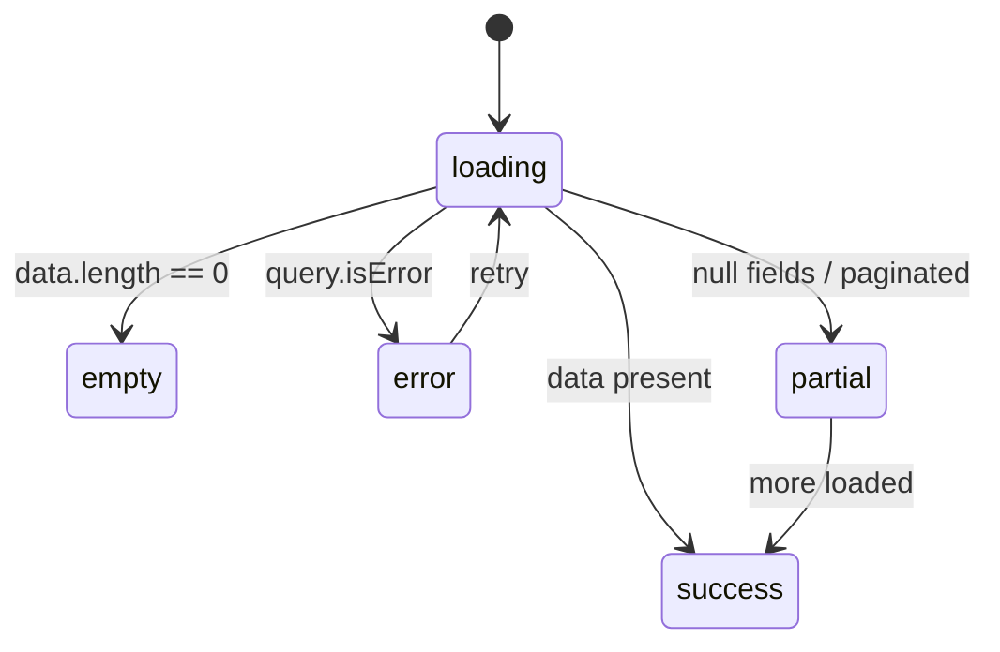

# UI States & Feedback

**Concept.** The backend answers "the operation succeeded or it threw". The frontend answers a harder question: **what the user SEES while it happens, and what they FEEL when it fails.** Every surface backed by an async query/mutation has several realities, not one. A component that only renders the happy path is "correct" for every structural gate — and still hands a white box to the real user with no data, a slow network or an expired token. This section turns "usable" into a gate, not into hope.

> **How to read this file.** Two parts, deliberately separated:
> - **🌐 Generic pattern** — the **portable law**. Holds in any stack (React, Vue, etc.); the text stays true even after swapping frameworks. This is what review enforces as an invariant.
> - **🛠️ Project-specific** — the **code** that implements each rule in the current stack (TypeScript · React · TanStack · @turystack). Swapping stacks rewrites **only** this part; the law above does not change.
>
> Each rule carries an id `UST-n` linking the law (generic) to the code (specific). Gates bind by **id**, not by file/line. `UST-L*` rules are **stack lints**: they exist only because of the current language's ergonomics (they invert in another stack), but they stay id-registered and enforced in this project.

---

## 🌐 Generic pattern (portable — stack-independent)

**ARC-ERR-8 — the five realities of every surface with data.** Every surface backed by async data has **five states** — and each one is decided explicitly before any styling of the happy path. `success` is the only one that is always born; the other four are the law. The fixtures that prove the five branches live in the tests (see 13-testing.md). **[ARC-ERR-8]**

| State | Law |
|---|---|
| **loading** | Skeleton on the first load or on a full replacement; `LoadingOverlay` when valid content stays on screen during an update; a spinner only for a compact operation of unknown shape. Real-time updates in-place, with no loading. |
| **empty** | An intentional state of its own, with copy + the next action. Never visually identical to loading. |
| **error** | A retry affordance, not a dead end. It tells "failed to load" apart from "you are not allowed to see this" (permission). |
| **partial** | Paginated / streamed / null fields — the dangerous middle that devs forget. |
| **success** | The only one that normally gets built. |



**UST-2 — honest loading preserves continuity.** Use a skeleton that replicates the next shape on the first load or when the whole useful region will be replaced; use a loading overlay over valid content during an async update that enters loading; use a spinner only for a compact, indeterminate operation of unknown shape. Real-time events update the content in-place without entering loading. Never cause a flash/layout shift nor disguise loading as another state (see 02-sdk.md). **[UST-2]**

**UST-3 — empty is product, not absence.** The empty state is an intentional state: copy that explains + the next possible action. Never visually identical to loading — the user has to tell "I am waiting" apart from "there is nothing here". **[UST-3]**

**UST-4 — error with a way out.** The error state offers retry, never a dead end. It tells "failed to load" (retry solves it) apart from "you are not allowed to see this" (permission — see 12-security-permissions.md). The message shown is the one that came from the API, as it came (see 11-error-handling.md). **[UST-4]**

**UST-5 — partial is a state, not a bug.** A paginated list shows the current page + honest navigation; an optional/null field renders a deliberate placeholder (`—`), never a raw `undefined` nor a crash. The middle ground between "nothing" and "everything" is designed, not endured. Dynamic pagination consumption in 02-sdk.md. **[UST-5]**

**UST-6 — mutation feedback contract.** Every async action has: a pending that **disables the trigger** (no double-fire) and a result that is **always surfaced** — success and error via toast or inline. A silent mutation does not exist. **[UST-6]**

**UST-7 — destructive confirms first.** Every destructive action goes through explicit confirmation before firing. **[UST-7]**

**ARC-CON-10 — optimistic declares the three steps.** An optimistic update only exists with the three written down: a snapshot before the write to the cache; reconciliation with the response on success (the server may have written a different value); restoring the snapshot **and a visible error** on failure. Reverting silently is worse than not being optimistic — the value "comes back on its own" and the user does not know the action failed. Without the three, invalidate and wait. **[ARC-CON-10]**

### Invariants (the law the gates enforce)

> Bind by **id**. `constitutional` = portable invariant (holds in any stack). `stack lint` = exists only because of the current language's ergonomics and inverts in another stack — still id-registered and enforced here. The **detector** (how the gate catches the violation) is project-specific and lives in the 🛠️ part below.

| ID | Law (one line) | Type | Detector (🛠️) |
|---|---|---|---|
| UST-2 | Skeleton on the first load/full replacement; overlay when valid content stays; real-time with no loading | constitutional | Scenarios 1 and 4 / ❌ |
| UST-3 | Intentional empty with copy + next action; never identical to loading | constitutional | Scenario 1 / ❌ |
| UST-4 | Error with retry; failed-to-load ≠ permission-denied; the API message shown as it came | constitutional | Scenario 1 / ❌ |
| UST-5 | Partial designed: honest pagination, null field with a deliberate placeholder | constitutional | Scenario 1 / ❌ |
| UST-6 | Mutation: pending disables the trigger; success/error always surfaced (toast or inline) | constitutional | Scenario 2 / ❌ |
| UST-7 | A destructive action goes through explicit confirmation | constitutional | Scenario 2 / ❌ |

## Governed by the constitution

These laws live in `tury-stack-architecture-pattern` and are not restated here.
What follows in this section is how the Turystack frontend expresses them.

| ID | Law |
|---|---|
| `ARC-ERR-8` | A remote read has five outcomes; all of them decided. |
| `ARC-CON-10` | An optimistic write declares snapshot, reconciliation and rollback. |
| `ARC-CON-9` | A replica is derived; a write declares what it invalidates. |
| `ARC-ERR-6` | The consumer branches on a code, never on a message. |
| `ARC-ERR-7` | Every error becomes visible feedback or a propagated failure. |

The `UST-*` laws that remain are presentational: *how* each outcome shows up in
this stack (skeleton × overlay, empty copy, retry affordance). The fact that the
five exist is `ARC-ERR-8`.

---

## 🛠️ Project-specific (TypeScript · React · TanStack · @turystack)

> Code that implements the rules above in this stack. **Swapping stacks rewrites only this part.** Each block inherits the id of the rule it demonstrates.
>
> **⚠️ Comments in the examples are didactic** — they explain the rule being demonstrated. **Never copy a comment into real code**: the standard is zero comments (see 00-overview.md).

**Mechanisms per rule:**

- **ARC-ERR-8** — TanStack Query through the `~sdk` hooks: `isPending`/`error`/`data` are the branch keys. Canonical order of early returns: pending → error → empty → render (partial lives inside the render). The fixtures for the five states (`isPending`, `isError`, `[]`, a partial page, data) are mounted in tests — see 13-testing.md.
- **UST-2** — react-web's `Skeleton` replicates the next shape on the initial `isPending` or on a full replacement, such as list pagination. When the query keeps the previous data during `isFetching`, `LoadingOverlay` preserves that content; in `Table`, use the `loading` prop for filter, sort and pagination after the first result. `Loader` stays restricted to a compact operation of unknown shape. A subscription/real-time event applies the change to the cache without turning loading on.
- **UST-3** — an empty composed with `Flex` + `Typography` + a next-action `Button`; in `Table`, the `emptySection` prop.
- **UST-4** — `Alert variant="destructive"` with `Alert.Title`/`Alert.Description` + `Alert.Action` calling `refetch`. The description is `error.message` **as it came** (branch only on `error.code` — see 11-error-handling.md). A permission denial does not render the generic retry alert: either the surface never appears (`<Protected>`) or the route denied it in `beforeLoad` — see 12-security-permissions.md.
- **UST-5** — react-web's `Pagination` fed by the response's `meta` (`mode: 'page' | 'cursor'` — the complete switch is a law of 02-sdk.md); an optional field renders a deliberate `—`.
- **UST-6** — `Button loading={isPending}` (the prop already blocks a new click); react-web's `toast.success(...)` / `toast.error(error.message)`; an inline field error via RHF's `setError` (see 05-forms.md). Invalidating the list on success is a law of 02-sdk.md.
- **UST-7** — react-web's `Confirm` (`title`, `description`, `onConfirm`, `onCancel`) controlled by `useDisclosure` from `@turystack/react-hooks` — never a hand-rebuilt modal (see 03-components-client-state.md).
- **ARC-CON-10** — TanStack Query: `onMutate` cancels the query, takes a snapshot (`getQueryData`) and returns it as context; `onError` restores it (`setQueryData(queryKey, context.previous)`); `onSettled` invalidates — the final truth comes from the server.

### ✅ How to do it

**Scenario 1 — a query-backed list deciding the five branches:** `[ARC-ERR-8, UST-2, UST-3, UST-4, UST-5]`
```tsx
// src/features/invoices/components/invoice-list/invoice-list.types.ts
import type { ListInvoicesQuery } from '@/~sdk/invoices'

export type InvoiceListProps = {
  params: ListInvoicesQuery
  onCreate?: () => void
  onPageChange: (page: number) => void
  onLimitChange: (limit: number) => void
}
```
```tsx
// src/features/invoices/components/invoice-list/invoice-list.tsx
import {
  Alert,
  Button,
  Flex,
  Pagination,
  Skeleton,
  Typography,
} from '@turystack/react-web'

import { useListInvoices } from '@/~sdk/invoices'

import { InvoiceCard } from '@/features/invoices/components/invoice-card'

import type { InvoiceListProps } from './invoice-list.types'

export function InvoiceList({
  onCreate,
  onLimitChange,
  onPageChange,
  params,
}: InvoiceListProps) {
  const { data, error, isPending, refetch } = useListInvoices(params)

  function handleRetry() {
    refetch()
  }

  if (isPending) {
    return (
      // loading: skeleton with the SAME shape as the result — no layout shift
      <Flex direction="col" gap="md">
        <Skeleton className="h-24" />
        <Skeleton className="h-24" />
        <Skeleton className="h-24" />
      </Flex>
    )
  }

  if (error) {
    return (
      // error: the API message as it came + retry — never a dead end
      // (a permission denial never reaches here: <Protected>/beforeLoad — see 12-security-permissions.md)
      <Alert variant="destructive">
        <Alert.Title>Could not load the invoices</Alert.Title>
        <Alert.Description>{error.message}</Alert.Description>
        <Alert.Action>
          <Button onClick={handleRetry} variant="outline">
            Try again
          </Button>
        </Alert.Action>
      </Alert>
    )
  }

  if (data.data.length === 0) {
    return (
      // empty: intentional — copy + next action; visually distinct from loading
      <Flex align="center" direction="col" gap="md">
        <Typography weight="semibold">No invoices around here</Typography>
        <Typography variant="muted">Create the first invoice to get started</Typography>
        <Button onClick={onCreate}>New invoice</Button>
      </Flex>
    )
  }

  return (
    // success + partial: the current page is presented as a page, with navigation
    <Flex direction="col" gap="md">
      {data.data.map((invoice) => (
        <InvoiceCard invoice={invoice} key={invoice.invoiceId} />
      ))}
      {data.meta.mode === 'page' && (
        // meta is a union discriminated on mode — the complete page/cursor switch
        // is a law of 02-sdk.md
        <Pagination
          mode="offset"
          onPageChange={onPageChange}
          onRowsPerPageChange={onLimitChange}
          page={data.meta.page}
          rowsPerPage={data.meta.limit}
          total={data.meta.totalItems}
        />
      )}
    </Flex>
  )
}
```

**Scenario 2 — mutation with pending, feedback and a destructive `Confirm`:** `[UST-6, UST-7]`
```tsx
// src/features/invoices/components/invoice-delete/invoice-delete.tsx
import { useDisclosure } from '@turystack/react-hooks'
import { Button, Confirm, toast } from '@turystack/react-web'

import { useDeleteInvoice } from '@/~sdk/invoices'

import type { InvoiceDeleteProps } from './invoice-delete.types'

export function InvoiceDelete({ invoice, onSuccess }: InvoiceDeleteProps) {
  const confirm = useDisclosure()
  const { isPending, mutate } = useDeleteInvoice()

  function handleConfirm() {
    mutate(
      { invoiceId: invoice.invoiceId },
      {
        onSuccess: () => {
          toast.success('Invoice deleted') // success ALWAYS surfaced
          confirm.close()
          onSuccess?.() // list invalidation: see 02-sdk.md
        },
        onError: (error) => {
          toast.error(error.message) // message as it came from the API — see 11-error-handling.md
        },
      },
    )
  }

  return (
    <>
      {/* pending disables the trigger — loading blocks the double-fire */}
      <Button loading={isPending} onClick={confirm.open} variant="destructive">
        Delete invoice
      </Button>
      <Confirm
        description="The invoice will be permanently deleted."
        onCancel={confirm.close}
        onConfirm={handleConfirm}
        open={confirm.opened}
        title="Delete invoice?"
      />
    </>
  )
}
```

**Scenario 3 — optimistic update with a defined rollback:** `[ARC-CON-10]`
```tsx
// src/features/notifications/components/notification-item/notification-item.tsx — mutation excerpt
import { useQueryClient } from '@tanstack/react-query'
import { toast } from '@turystack/react-web'

import {
  listNotificationsQueryKey,
  useReadNotification,
} from '@/~sdk/notifications'

import type { NotificationItemProps } from './notification-item.types'

export function NotificationItem({ notification, params }: NotificationItemProps) {
  const queryClient = useQueryClient()
  const queryKey = listNotificationsQueryKey(params)

  const { mutate } = useReadNotification({
    mutation: {
      onMutate: async ({ notificationId }) => {
        await queryClient.cancelQueries({ queryKey })
        const previous = queryClient.getQueryData(queryKey) // snapshot = the rollback
        queryClient.setQueryData(queryKey, (current) =>
          current
            ? {
                ...current,
                data: current.data.map((item) =>
                  item.notificationId === notificationId
                    ? { ...item, readAt: new Date().toISOString() }
                    : item,
                ),
              }
            : current,
        )
        return { previous }
      },
      onError: (error, _variables, context) => {
        queryClient.setQueryData(queryKey, context?.previous) // DEFINED rollback
        toast.error(error.message)
      },
      onSettled: () => {
        queryClient.invalidateQueries({ queryKey }) // the final truth comes from the server
      },
    },
  })

  // ...
}
```

**Scenario 4 — choosing feedback by continuity:** `[UST-2]`

| Case | Implementation |
|---|---|
| First load of a list, table or chart | `Skeleton` in the final shape |
| List pagination that swaps every card/item | `Skeleton` of the next items |
| Table filter, sort or pagination with the previous data preserved | `<Table loading />` |
| Filter on an already rendered chart | `LoadingOverlay` over the previous chart |
| Subscription/real-time event | update the cache and render in-place, with no loading state |

### ❌ Never do

```tsx
// ❌ [ARC-ERR-8] happy-path-only: zero branches — a white box for whoever has no data
export function InvoiceList({ params }: InvoiceListProps) {
  const { data } = useListInvoices(params)
  return <>{data?.data.map((invoice) => <InvoiceCard invoice={invoice} key={invoice.invoiceId} />)}</>
}

// ❌ [UST-2] a generic spinner with a known shape — flash + layout shift on the swap
if (isPending) {
  return <Loader />
}

// ❌ [UST-2] a skeleton wipes a useful table during pagination/refetch
if (isFetching) {
  return <UserTableSkeleton />
}

// ❌ [UST-2] a real-time event treated as a new blocking request
return <Table loading={lastEventIsBeingApplied} />

// ❌ [UST-3] silent fallback: during loading the list turns into a FALSE empty
const invoices = data?.data ?? []
if (invoices.length === 0) {
  return <Typography>No invoices</Typography>
}

// ❌ [UST-4] a dead-end error with a hand-rewritten message (see 11-error-handling.md)
if (error) {
  return <Typography>Something went wrong</Typography>
}

// ❌ [UST-5] an optional field rendered raw — partial not designed
<Typography>{formatDate(invoice.paidAt)}</Typography> // paidAt null → "Invalid Date" on screen

// ❌ [UST-6, UST-7] destructive with no Confirm, no pending, no feedback —
// a guaranteed double-fire and the user never knows whether it worked
<Button onClick={handleDelete} variant="destructive">Delete</Button>
// where handleDelete calls mutate() directly, with no loading, toast or confirmation

// ❌ [ARC-CON-10] optimistic with no rollback — the mutation failed and the cache lies forever
onMutate: ({ notificationId }) => {
  queryClient.setQueryData(queryKey, next)
}
```
